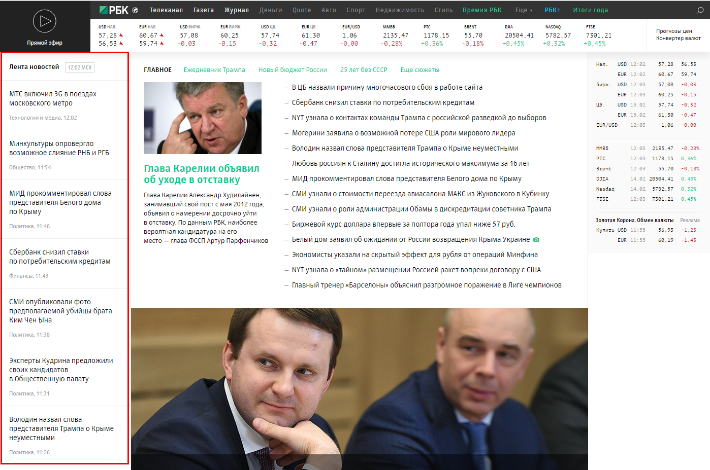

# Задание

Спарсить (программно) первые 15 новостей с rbk.ru (блок, откуда брать новости показан на скриншоте) и вставить в базу данных (составить структуру самому) или в файл. Вывести все новости, сократив текст до 200 символов в качестве описания, со ссылкой на полную новость с кнопкой подробнее. На полной новости выводить картинку если есть в новости.

## Screenshot



## Реализация

Фреймворками решил не пользоваться, реализовал простенький свой при помощи композеровских пакетов.

Заюзал DI контейнер, мы про него говорили на собеседовании - решил потрогать...

Все обернул в докер... должен запуститься на Линуксе или Убунте без проблем (Ну, я надеюсь... хех)

Парсинг происходит по средством phpQuery (Это доступнее регулярок)

Все хранится в Mysql (Percona), картинки лежат там же... в декоженом виде (blob)...

## Run

Для запуска необходимо иметь линукс, мак с установленными актуальными doker и docker-compose

Так-же необходимо освободить порты 80 3306 10000

Собирается это все примерно так:

```
cd docker
./install
```

Во время выполнения скрипта произойдет следующее

1. Соберется 3 контейнера с php-fpm, percona и nginx
2. Накатиться структура базы
3. Установятся пакеты композера
4. Выплнится парсинг 15 статей
5. Контейнеры остановятся

Чтобы Запустить контейнеры заново

```
docker-compose up
```

Сайт будет доступен на 80 порту [http://localhost:80](http://localhost:80/).

Парсинг статей сделан через консольку... для запуска можно выполнить внутри контейнера php-fpm

```
php console.php parse
```

Так же есть опциональные команды для парсинга

```
php console.php parse --limit=40 --project=rbcnews.spb_sz
```

Где --limit это колличество статей которые мы хотим спарсить
а --project это регион из которого брать... (Сложно сказать какие еще есть)

Или можно с локальной кнсольки выполнив 
```
docker exec -ti php-fpm sh -c "php console.php parse"
```